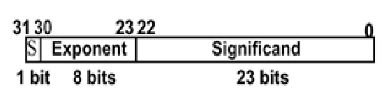
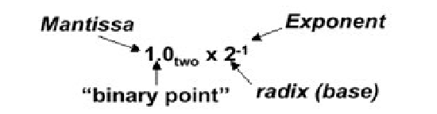
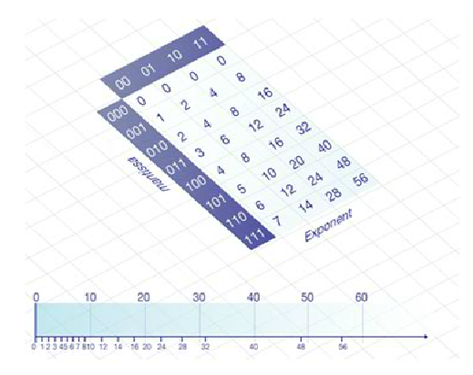
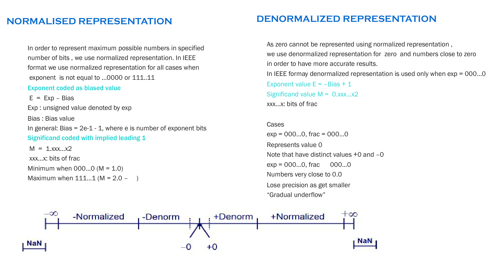

## What are floating point numbers

As the name implies, floating point numbers are numbers that contain
floating decimal points. For example, the numbers 5.5, 0.001, and
-2,345.6789 are floating point numbers. Numbers that do not have
decimal places are called integers.Computers recognize real numbers
that contain fractions as floating point numbers. When a calculation
includes a floating point number, it is called a "floating point
calculation." Older computers used to have a separate floating point
unit (FPU) that handled these calculations, but now the FPU is
typically built into the computer's CPU.

## Floating-Point Format

Computers store floating point numbers in a specific format . As our
aim is to maximize the range of numbers that can be stored .FPUs
typically represent real numbers in a binary floating-point format. In
this format, a real number has three parts: a sign, a significand, and
an exponent. The following explaination  is in accordance with the
standard IEEE format of 32 bit representation .

  

### **Exponent Field**

->  8 - Bits Long 
->   Determines The Range Of Numbers That Can be Represented 
->   Increasing The Bits Will Increase The Range , Not Precision
 ->   To Cover For -ve Numbers , exp = 127 + real exp

### **Sign Bit**
-> 1- Bit Long 
->  Dtermines The +ve or -ve number
->   1 = -ve Number      0 =  +ve Number

### **Mantissa Field**
-> 23 - Bits Long 
->  Determines the precision of Numbers 
-> Increasing bits Will Increase precision, not range.

# Consequence #1: Values are unevenly spaced

-> Imagine we only had 6 bits for each floating-point number
     (1 sign, 3 mantissa, 2 exponent)

->  Means less absolute precision for numbers with larger magnitudes

-> More bits ....More The Accuracy

->  That is why the numbers are more densed near the zero as compared to far away from the number line.

  

# Consequence #2: Roundoff errors

  -> Our system can represent 6, and it can represent ¼, but not 5¾

  ->   So 6 - 0.25 is 6, not 5.75

  ->  And if 6 - 0.25 - 0.25 - 0.25 - 0.25 is evaluated left to
right, the answer is still 6

   -> This is not random
        Happens exactly the same way every time

  

